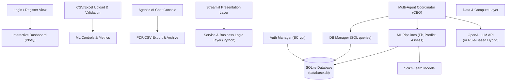
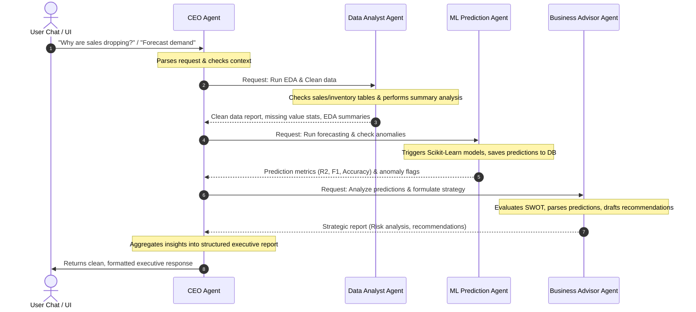
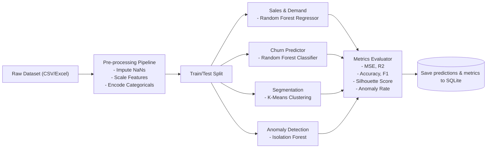

# BusinessPilotAI System Architecture

This document details the system architecture, agent interaction models, database relations, and machine learning pipelines for **BusinessPilotAI**.

---

## 1. System Block Diagram

The system follows a classic multi-tiered architecture combining a modern interactive presentation layer (Streamlit), a secure business logic service layer (Python services), a local data management system (SQLite), specialized ML models (Scikit-Learn), and a collaborative Agentic AI coordinator.

---

## 2. Multi-Agent Agentic Workflow

The Agentic AI core is orchestrated by the **CEO Agent** which coordinates tasks between specialized agents in a directed sequential loop with verification.

---

## 3. Agent Responsibilities & Prompts

### A. CEO Agent
- **Role**: Workflow Coordinator, Task Assigner, Output Compiler.
- **Workflow**:
  1. Accepts user query.
  2. Resolves database state and available resources.
  3. Formulates a plan and sequentially calls the Analyst, ML, and Advisor.
  4. Merges outputs into a executive summary.

### B. Data Analyst Agent
- **Role**: Data Cleaning & Exploration.
- **Workflow**:
  1. Checks for nulls, incorrect formats, and outliers in uploaded CSVs.
  2. Formulates clean descriptive statistics (totals, averages, distributions).
  3. Compiles a dataset summary report.

### C. ML Prediction Agent
- **Role**: Model Execution and Performance Assessment.
- **Workflow**:
  1. Identifies the correct task type: forecasting (regression/time-series), churn (classification), segmentation (clustering), or anomaly detection (unsupervised).
  2. Trains or loads corresponding Scikit-Learn pipelines.
  3. Formulates metrics tables (Confusion Matrix, Precision, Recall, F1).
  4. Saves prediction rows into SQLite.

### D. Business Advisor Agent
- **Role**: Decision Support & Strategy Advisor.
- **Workflow**:
  1. Reads numerical insights from Analyst and ML predictions.
  2. Creates a SWOT analysis.
  3. Formulates a list of risk assessments and actionable strategic guidelines.

---

## 4. Machine Learning Module Pipelines

---

## 5. Database Schema Design (Normalized)

The SQLite database will consist of 10 fully normalized tables:

1. **`users`**: Auth information, password hashes, registration times, roles.
2. **`companies`**: Details of businesses registered under user accounts.
3. **`products`**: Product inventory names, unit costs, pricing, categories.
4. **`customers`**: Profiles of buyers (demographics, tenure, registration details).
5. **`sales`**: Base transaction table detailing invoice, sales amount, tax, and margins.
6. **`orders`**: Links customer purchases to specific products and quantities.
7. **`inventory`**: Warehouse stock levels, reorder thresholds, and location details.
8. **`predictions`**: Stores ML outputs (forecasted values, churn probability, clusters, anomaly flags) linked to corresponding records.
9. **`reports`**: Log of generated executive summaries and downloads.
10. **`agent_logs`**: Step-by-step communication transcripts and latency parameters for audit trails.
